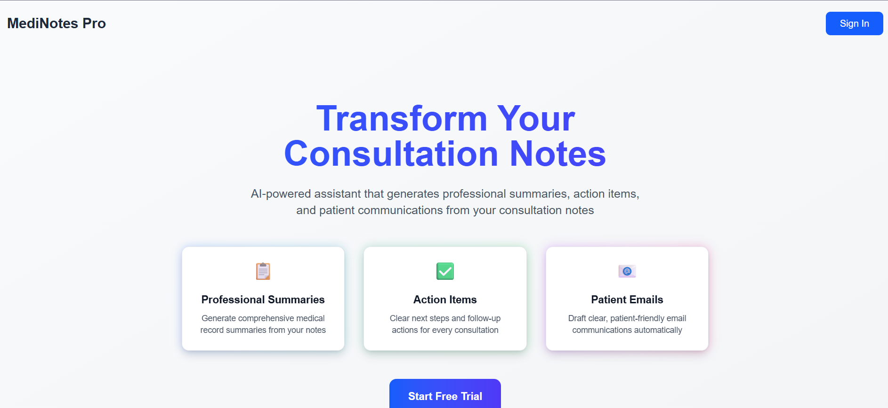

# MediNotes Pro – Healthcare Consultation Assistant

MediNotes Pro is a professional healthcare consultation assistant designed to help medical professionals transform raw consultation notes into structured, actionable, and patient-friendly outputs using AI.

The application streamlines clinical documentation by generating medical summaries, follow-up actions, and patient email drafts — all from a single consultation form.

---

## ✨ Features

- **Structured Consultation Input**
  - Patient name
  - Date of visit (date picker)
  - Free-form consultation notes

- **AI-Powered Outputs**
  - Professional summaries for medical records
  - Clear next steps and action items for clinicians
  - Patient-friendly email drafts

- **Real-Time Streaming**
  - AI-generated content streams live as it’s created

- **Secure & Authenticated**
  - JWT-based authentication
  - Subscription-gated access for premium users

- **Modern Healthcare UI**
  - Clean, professional design
  - Optimized for clinical workflows

---

## 🧠 How It Works

1. A clinician enters consultation details into a structured form.
2. The backend validates the data and sends it to the AI model.
3. The AI responds with three clearly defined sections:
   - Summary of visit for medical records
   - Next steps for the doctor
   - Draft email written in patient-friendly language
4. Results are streamed back to the frontend in real time.

---

## 🏗️ Tech Stack

### Frontend
- **Next.js**
- **React**
- **Tailwind CSS**
- **Clerk Authentication**
- **react-datepicker**
- **Server-Sent Events (SSE)** for streaming responses

### Backend
- **FastAPI**
- **Pydantic** for request validation
- **OpenAI API**
- **JWT authentication via Clerk**

---

Link: https://saas-lawr2c73b-ongun-tunas-projects.vercel.app/